# Claude Code PM - Gitea 專用版

> 🔧 **Gitea 專用版本**：這是一個獨立的分支，僅支援 Gitea。
>
> **原始專案**：[automazeio/ccpm](https://github.com/automazeio/ccpm) 作者：[@aroussi](https://x.com/aroussi)
> **授權條款**：MIT（與原始專案相同）
>
> 此版本移除了 GitHub 支援，簡化程式碼庫，專注於 Gitea 工作流程。

[](https://automaze.io)
 
[](https://github.com/automazeio/ccpm/blob/main/README.md)
[](https://gitea.com)
 
[](https://github.com/automazeio/ccpm/blob/main/LICENSE)
 
[](http://x.com/intent/follow?screen_name=aroussi)

### Claude Code 工作流程，使用規格驅動開發、Gitea Issues、Git Worktrees 和多個並行執行的 AI 代理，交付~~更快~~_更好_的成果。

**[English Documentation](README.md)** | **[簡體中文文檔](zh-docs/README_ZH.md)**

停止遺失上下文。停止任務阻塞。停止交付臭蟲。這個經過實戰驗證的系統將 PRD 轉化為 Epic、Epic 分解為 Gitea Issues、Issues 轉化為生產程式碼——每一步都有完整的可追溯性。


## 目錄

- [背景](#背景)
- [工作流程](#工作流程)
- [與眾不同之處](#與眾不同之處)
- [為什麼選擇 Gitea Issues？](#為什麼選擇-gitea-issues)
- [核心原則：拒絕憑感覺編碼](#核心原則拒絕憑感覺編碼)
- [系統架構](#系統架構)
- [工作流程階段](#工作流程階段)
- [命令參考](#命令參考)
- [並行執行系統](#並行執行系統)
- [主要功能與優勢](#主要功能與優勢)
- [已驗證的成果](#已驗證的成果)
- [範例流程](#範例流程)
- [立即開始](#立即開始)
- [本地 vs 遠端](#本地-vs-遠端)
- [技術說明](#技術說明)
- [支持本專案](#支持本專案)

## 背景

每個團隊都面臨同樣的問題：
- **上下文在會話之間消失**，迫使不斷重新探索
- **並行工作在多個開發者接觸相同程式碼時產生衝突**
- **需求偏移**，口頭決策覆蓋書面規格
- **進度在最後一刻之前都不可見**

這個系統解決了所有這些問題。

## 工作流程

```mermaid
graph LR
    A[PRD 建立] --> B[Epic 規劃]
    B --> C[任務分解]
    C --> D[Gitea 同步]
    D --> E[並行執行]
```



### 實際操作演示（60 秒）

```bash
# 透過引導式腦力激盪建立全面的 PRD
/pm:prd-new memory-system

# 將 PRD 轉化為技術 Epic 並進行任務分解
/pm:prd-parse memory-system

# 推送至 Gitea 並開始並行執行
/pm:epic-oneshot memory-system
/pm:issue-start 1235
```

## 與眾不同之處

| 傳統開發             | Claude Code PM 系統                  |
| -------------------- | ------------------------------------ |
| 會話之間遺失上下文   | **跨所有工作的持久上下文**           |
| 序列任務執行         | **並行代理處理獨立任務**             |
| 從記憶中「憑感覺編碼」 | **規格驅動，全程可追溯**             |
| 進度隱藏在分支中     | **Gitea 中的透明稽核軌跡**           |
| 手動任務協調         | **智慧優先順序排序，使用 `/pm:next`** |

## 為什麼選擇 Gitea Issues？

大多數 Claude Code 工作流程在孤立環境中運作——單一開發者在本地環境中與 AI 協作。這產生了一個根本問題：**AI 輔助開發變成了孤島**。

透過使用 Gitea Issues 作為我們的資料庫，我們解鎖了強大的功能：

### 🤝 **真正的團隊協作**
- 多個 Claude 實例可以同時處理同一專案
- 人類開發者透過 Issue 評論即時查看 AI 進度
- 團隊成員可以隨時加入——上下文始終可見
- 管理者獲得透明度而無需中斷流程

### 🔄 **無縫的人機交接**
- AI 可以開始任務，人類可以完成任務（反之亦然）
- 進度更新對每個人可見，不會困在聊天記錄中
- 程式碼審查透過 PR 評論自然發生
- 無需召開「AI 做了什麼？」會議

### 📈 **超越個人工作的可擴展性**
- 新增團隊成員無需繁瑣的入職流程
- 多個 AI 代理並行處理不同 Issues
- 分散式團隊自動保持同步
- 與現有的 Gitea 工作流程和工具相容

### 🎯 **單一真相來源**
- 無需單獨的資料庫或專案管理工具
- Issue 狀態即專案狀態
- 評論即稽核軌跡
- 標籤提供組織結構

這不僅僅是一個專案管理系統——它是一個**協作協議**，讓人類和 AI 代理能夠大規模協作，使用團隊已經信任的基礎設施。

## 核心原則：拒絕憑感覺編碼

> **每一行程式碼都必須可追溯到規格。**

我們遵循嚴格的 5 階段紀律：

1. **🧠 腦力激盪** - 深入思考，超越舒適區
2. **📝 文件化** - 撰寫不留任何解釋空間的規格
3. **📐 規劃** - 透過明確的技術決策進行架構設計
4. **⚡ 執行** - 精確建構規格中指定的內容
5. **📊 追蹤** - 在每一步保持透明進度

不走捷徑。不做假設。不留遺憾。

## 系統架構

```
.claude/
├── CLAUDE.md          # 始終啟用的指令（將內容複製到專案的 CLAUDE.md 檔案中）
├── agents/            # 面向任務的代理（用於上下文保存）
├── commands/          # 命令定義
│   ├── context/       # 建立、更新和準備上下文
│   ├── pm/            # ← 專案管理命令（此系統）
│   └── testing/       # 準備和執行測試（編輯此部分）
├── context/           # 專案範圍的上下文檔案
├── epics/             # ← PM 的本地工作區（放入 .gitignore 中）
│   └── [epic-name]/   # Epic 和相關任務
│       ├── epic.md    # 實作計畫
│       ├── [#].md     # 個別任務檔案
│       └── updates/   # 進行中的更新
├── prds/              # ← PM 的 PRD 檔案
├── rules/             # 將任何規則檔案放在此處以供參考
└── scripts/           # 將任何腳本檔案放在此處以供使用
```

## 工作流程階段

### 1. 產品規劃階段

```bash
/pm:prd-new feature-name
```
啟動全面的腦力激盪，建立產品需求文件，捕捉願景、使用者故事、成功標準和限制條件。

**輸出：** `.claude/prds/feature-name.md`

### 2. 實作規劃階段

```bash
/pm:prd-parse feature-name
```
將 PRD 轉化為技術實作計畫，包含架構決策、技術方法和相依性對應。

**輸出：** `.claude/epics/feature-name/epic.md`

### 3. 任務分解階段

```bash
/pm:epic-decompose feature-name
```
將 Epic 分解為具體的、可執行的任務，包含驗收標準、工作量估算和並行化標誌。

**輸出：** `.claude/epics/feature-name/[task].md`

### 4. Gitea 同步

```bash
/pm:epic-sync feature-name
# 或對於有信心的工作流程：
/pm:epic-oneshot feature-name
```
將 Epic 和任務作為 Issues 推送到 Gitea，帶有適當的標籤和關係。

### 5. 執行階段

```bash
/pm:issue-start 1234  # 啟動專門代理
/pm:issue-sync 1234   # 推送進度更新
/pm:next             # 取得下一個優先任務
```
專門代理實作任務，同時保持進度更新和稽核軌跡。

## 命令參考

> [!TIP]
> 輸入 `/pm:help` 取得簡潔的命令摘要

### 初始設定
- `/pm:init` - 安裝相依性並設定 Gitea

### PRD 命令
- `/pm:prd-new` - 為新產品需求啟動腦力激盪
- `/pm:prd-parse` - 將 PRD 轉換為實作 Epic
- `/pm:prd-list` - 列出所有 PRD
- `/pm:prd-edit` - 編輯現有 PRD
- `/pm:prd-status` - 顯示 PRD 實作狀態

### Epic 命令
- `/pm:epic-decompose` - 將 Epic 分解為任務檔案
- `/pm:epic-sync` - 將 Epic 和任務推送到 Gitea
- `/pm:epic-oneshot` - 一次性分解和同步命令
- `/pm:epic-list` - 列出所有 Epic
- `/pm:epic-show` - 顯示 Epic 及其任務
- `/pm:epic-close` - 標記 Epic 為完成
- `/pm:epic-edit` - 編輯 Epic 詳情
- `/pm:epic-refresh` - 從任務更新 Epic 進度

### Issue 命令
- `/pm:issue-show` - 顯示 Issue 和子 Issues
- `/pm:issue-status` - 檢查 Issue 狀態
- `/pm:issue-start` - 開始工作並啟動專門代理
- `/pm:issue-sync` - 將更新推送到 Gitea
- `/pm:issue-close` - 標記 Issue 為完成
- `/pm:issue-reopen` - 重新開啟已關閉的 Issue
- `/pm:issue-edit` - 編輯 Issue 詳情

### 工作流程命令
- `/pm:next` - 顯示下一個優先 Issue 及 Epic 上下文
- `/pm:status` - 整體專案儀表板
- `/pm:standup` - 每日站會報告
- `/pm:blocked` - 顯示被阻塞的任務
- `/pm:in-progress` - 列出進行中的工作

### 同步命令
- `/pm:sync` - 與 Gitea 的雙向同步
- `/pm:import` - 匯入現有的 Gitea Issues

### 維護命令
- `/pm:validate` - 檢查系統完整性
- `/pm:clean` - 歸檔已完成的工作
- `/pm:search` - 搜尋所有內容

## 並行執行系統

### Issues 並非原子性的

傳統思維：一個 Issue = 一個開發者 = 一個任務

**現實：一個 Issue = 多個並行工作流**

單一「實作使用者認證」Issue 不是一個任務。它是...

- **代理 1**：資料庫表格和遷移
- **代理 2**：服務層和業務邏輯
- **代理 3**：API 端點和中介軟體
- **代理 4**：UI 元件和表單
- **代理 5**：測試套件和文件

所有這些都在同一工作樹中**同時**執行。

### 速度的數學計算

**傳統方法：**
- 包含 3 個 Issues 的 Epic
- 序列執行

**本系統：**
- 同樣的 Epic 包含 3 個 Issues
- 每個 Issue 分解為約 4 個並行流
- **12 個代理同時工作**

我們不是將代理分配給 Issues。我們是**利用多個代理**來更快交付。

### 上下文優化

**傳統的單執行緒方法：**
- 主對話承載所有實作細節
- 上下文視窗填滿了資料庫架構、API 程式碼、UI 元件
- 最終達到上下文限制並失去連貫性

**並行代理方法：**
- 主執行緒保持乾淨和策略性
- 每個代理獨立處理自己的上下文
- 實作細節從不污染主對話
- 主執行緒保持監督而不會淹沒在程式碼中

你的主對話成為指揮家，而不是管弦樂團。

### Gitea vs 本地：完美分離

**Gitea 看到的內容：**
- 乾淨、簡單的 Issues
- 進度更新
- 完成狀態

**本地實際發生的事情：**
- Issue #1234 分解為 5 個並行代理
- 代理透過 Git 提交進行協調
- 複雜的編排對視圖隱藏

Gitea 無需知道工作是如何完成的——只需知道工作已完成。

### 命令流程

```bash
# 分析可以並行化的內容
/pm:issue-analyze 1234

# 啟動集群
/pm:epic-start memory-system

# 觀看奇蹟發生
# 12 個代理在 3 個 Issues 上工作
# 全部在：../epic-memory-system/ 中

# 完成時進行一次乾淨的合併
/pm:epic-merge memory-system
```

## 主要功能與優勢

### 🧠 **上下文保存**
永不遺失專案狀態。每個 Epic 維護自己的上下文，代理從 `.claude/context/` 讀取，並在同步前本地更新。

### ⚡ **並行執行**
透過多個代理同時工作來更快交付。標記為 `parallel: true` 的任務支援無衝突的並行開發。

### 🔗 **Gitea 原生支援**
與團隊已使用的工具相容。Issues 是真相來源，評論提供歷史，不依賴 Projects API。

### 🤖 **代理專業化**
每項工作都有合適的工具。不同的代理處理 UI、API 和資料庫工作。每個代理自動讀取需求並發布更新。

### 📊 **全程可追溯**
每個決策都有文件記錄。PRD → Epic → 任務 → Issue → 程式碼 → 提交。從想法到生產的完整稽核軌跡。

### 🚀 **開發者生產力**
專注於建構，而非管理。智慧優先順序排序，自動上下文載入，準備就緒時增量同步。

## 已驗證的成果

使用此系統的團隊報告：
- **89% 的時間**不再因上下文切換而遺失——你將很少使用 `/compact` 和 `/clear`
- **5-8 個並行任務** vs 之前的 1 個——同時編輯/測試多個檔案
- **臭蟲率降低 75%**——由於將功能分解為詳細任務
- **功能交付速度提升最多 3 倍**——基於功能大小和複雜度

## 範例流程

```bash
# 開始新功能
/pm:prd-new memory-system

# 審查和完善 PRD...

# 建立實作計畫
/pm:prd-parse memory-system

# 審查 Epic...

# 分解為任務並推送到 Gitea
/pm:epic-oneshot memory-system
# 建立 Issues：#1234（Epic），#1235，#1236（任務）

# 開始任務開發
/pm:issue-start 1235
# 代理開始工作，在本地維護進度

# 同步進度到 Gitea
/pm:issue-sync 1235
# 更新作為 Issue 評論發布

# 檢查整體狀態
/pm:epic-show memory-system
```

## 立即開始

### 快速設定（2 分鐘）

1. **將此儲存庫安裝到你的專案中**：

   #### Unix/Linux/macOS

   ```bash
   cd path/to/your/project/
   curl -sSL https://automaze.io/ccpm/install | bash
   # 或：wget -qO- https://automaze.io/ccpm/install | bash
   ```

   #### Windows（PowerShell）
   ```bash
   cd path/to/your/project/
   iwr -useb https://automaze.io/ccpm/install | iex
   ```

   #### 手動安裝（使用 git clone）

   如果你想手動安裝或已經有 `.claude` 目錄，可以使用以下步驟：

   ```bash
   # 方式一：使用安裝腳本（推薦）
   curl -sSL https://automaze.io/ccpm/install | bash

   # 方式二：手動 git clone
   cd your-project/
   git clone https://github.com/automazeio/ccpm.git temp-ccpm
   cp -r temp-ccpm/ccpm .claude
   rm -rf temp-ccpm
   ```

   > ⚠️ **重要**：如果你已有 `.claude` 目錄，請將此儲存庫複製到不同目錄，然後將複製的 `.claude` 目錄內容複製到你專案的 `.claude` 目錄中。

   查看完整的/其他安裝選項在 [安裝指南 ›](https://github.com/automazeio/ccpm/tree/main/install) 中


2. **初始化 PM 系統**：
   ```bash
   /pm:init
   ```
   此命令將：
   - 檢查並安裝 Gitea CLI（tea）（如需要）
   - 與 Gitea 實例進行身份驗證
   - 建立所需目錄
   - 在儲存庫中設定標籤
   - 更新 .gitignore

   > 💡 **身份驗證**：您需要先設定 tea CLI：
   > ```bash
   > tea login add --name myserver --url https://your-gitea.com --token YOUR_TOKEN
   > ```
   > 從 Gitea 設定 → 應用程式 → 產生新令牌 取得您的令牌

3. **建立包含儲存庫資訊的 `CLAUDE.md`**
   ```bash
   /init include rules from .claude/CLAUDE.md
   ```
   > 如果你已有 `CLAUDE.md` 檔案，執行：`/re-init` 來用 `.claude/CLAUDE.md` 中的重要規則更新它。

4. **準備系統**：
   ```bash
   /context:create
   ```


### 開始你的第一個功能

```bash
/pm:prd-new your-feature-name
```

觀看結構化規劃如何轉化為交付的程式碼。

## 本地 vs 遠端

| 操作       | 本地 | Gitea |
| ---------- | ---- | ------------ |
| PRD 建立   | ✅    | —            |
| 實作規劃   | ✅    | —            |
| 任務分解   | ✅    | ✅（同步）    |
| 執行       | ✅    | —            |
| 狀態更新   | ✅    | ✅（同步）    |
| 最終交付物 | —    | ✅            |

## 技術說明

### Gitea 整合
- **Gitea 專用版本** - 簡化並專注於 Gitea 工作流程
- 在 Epic Issue 本文中使用 markdown 任務列表追蹤任務
  - 格式：`- [ ] 任務：標題 #123`
  - 任務完成時會被勾選
- Epic Issues 透過任務列表自動追蹤子任務完成情況
- 標籤提供組織（`epic:feature`，`task:feature`）
- 與 Gitea 的 Issue 系統和工作流程完全整合

### 檔案命名慣例
- 任務在分解期間以 `001.md`、`002.md` 開始
- Gitea 同步後，重新命名為 `{issue-id}.md`（例如，`1234.md`）
- 便於導覽：Issue #1234 = 檔案 `1234.md`

### 設計決策
- 專注於 Gitea 以求簡化
- 所有命令首先在本地檔案上操作以提高速度
- 與 Gitea 的同步是明確且受控的
- Worktrees 為並行工作提供乾淨的 Git 隔離
- 使用 Gitea 的原生 Issue 系統，無需外部依賴

---

## 支持本專案

Claude Code PM 由 [Automaze](https://automaze.io) 開發，**為交付產品的開發者，由交付產品的開發者**。

如果 Claude Code PM 幫助你的團隊交付更好的軟體：

- ⭐ **[為此儲存庫加星](https://github.com/automazeio/ccpm)** 來表達你的支持
- 🐦 **[在 X 上追蹤 @aroussi](https://x.com/aroussi)** 取得更新和提示


---

> [!TIP]
> **使用 Automaze 更快交付。** 我們與創辦人合作，將他們的願景變為現實，擴展他們的業務，並優化成功。
> **[造訪 Automaze 與我預約通話 ›](https://automaze.io)**

---

## 加星歷史


